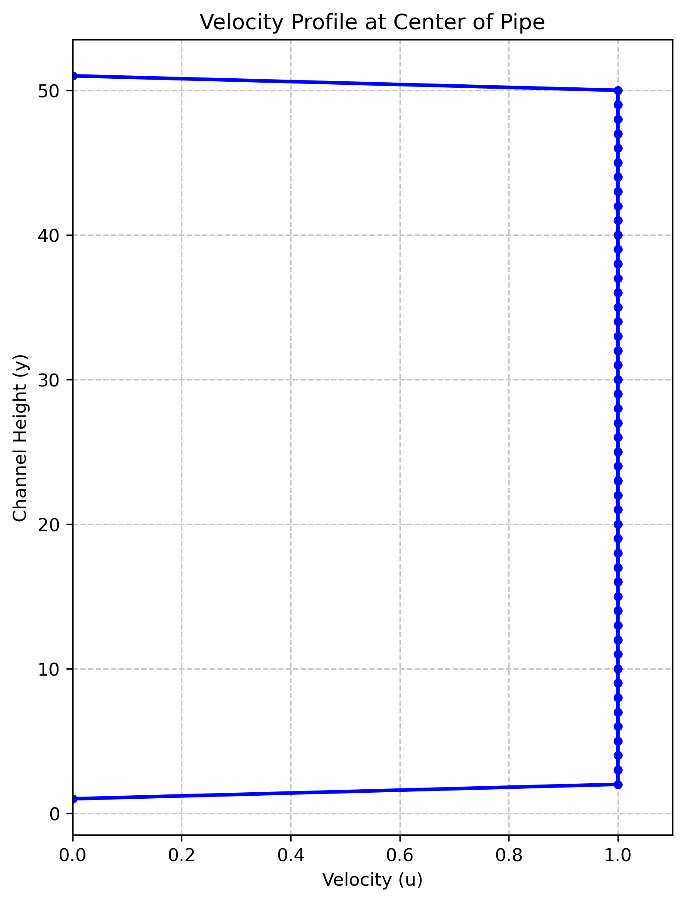
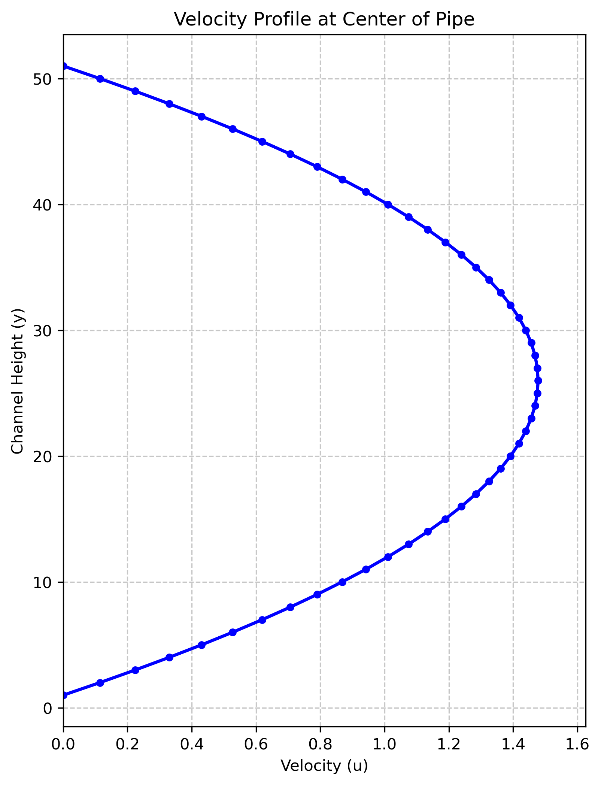
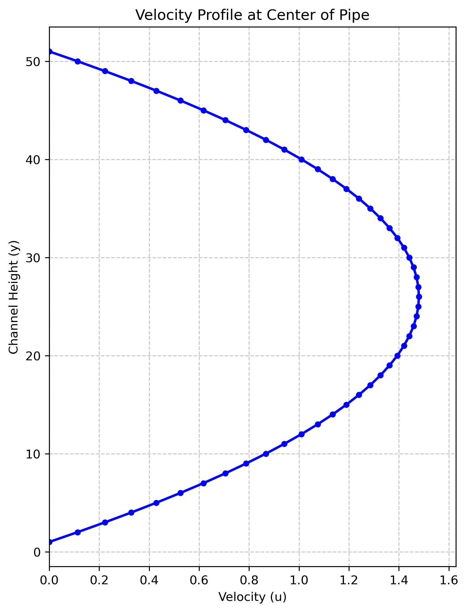
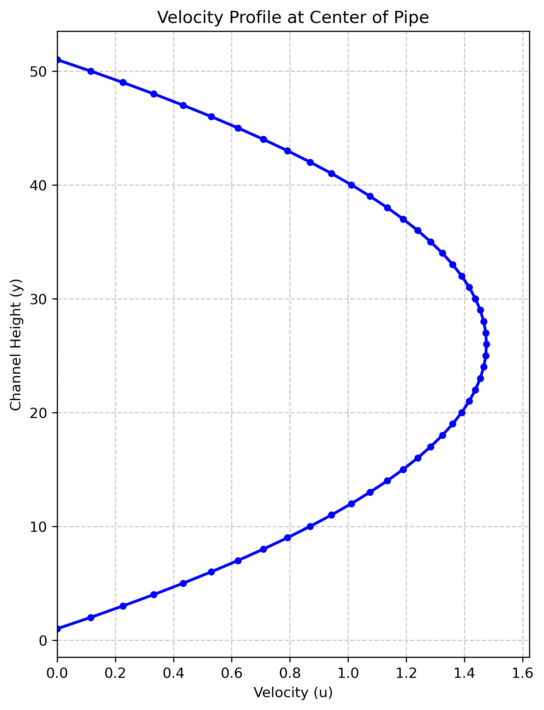
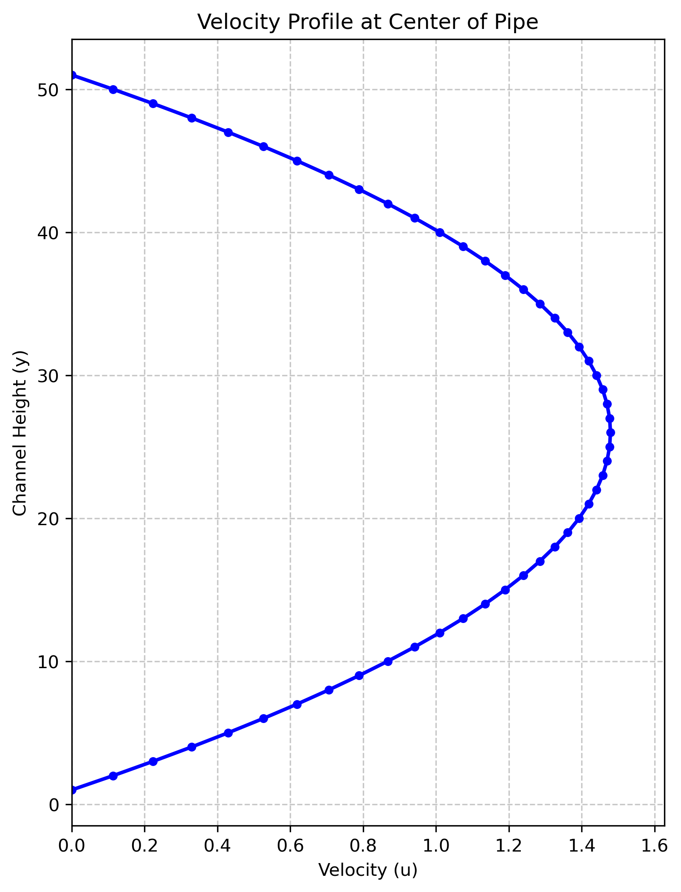
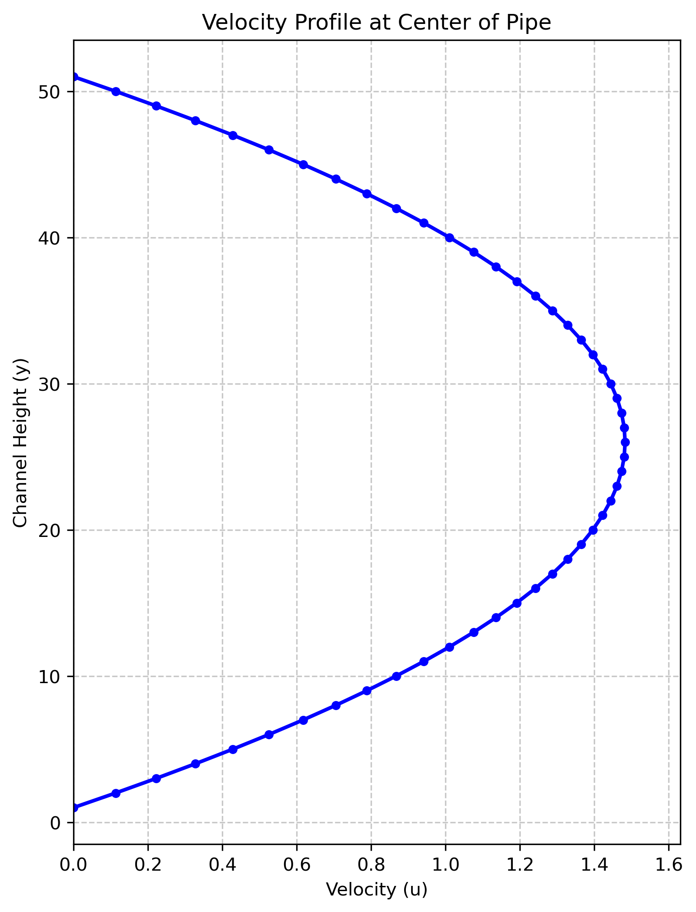
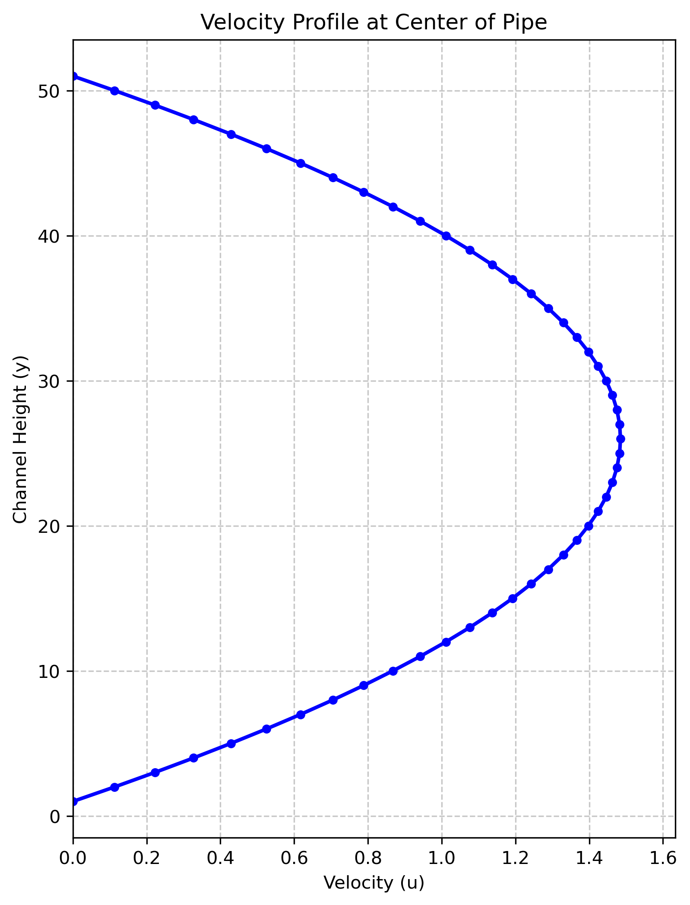
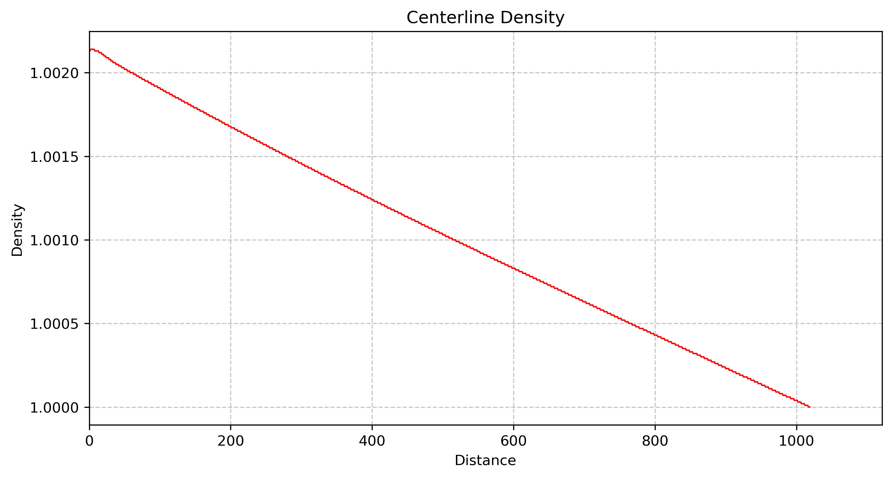

# Plane Poiseuille Flow Simulation using Lattice Boltzmann Method (LBM)

## Overview
This repository contains an Object-Oriented C++ implementation of a 2D Plane Poiseuille flow (flow between two parallel plates) using the Lattice Boltzmann Method. The solver tracks the spatial development of the flow from a uniform inlet velocity to a fully developed parabolic velocity profile. 

The simulation features an automated steady-state convergence check utilizing the $L^2$ relative error norm of the velocity field.

## Physics & Computational Parameters
* **Method:** LBM D2Q9 (Array of Structures pattern)
* **Flow Type:** Plane Poiseuille Flow (Channel Flow)
* **Reynolds Number (Re):** 10
* **Mach Number (Ma):** 0.01
* **Grid Resolution:** 1020 x 51 nodes ($L_x / L_y = 20$)
* **Convergence Criterion:** $L^2$ norm relative error $< 10^{-6}$

## Boundary Conditions
* **Top & Bottom Walls:** No-slip boundaries.
* **Inlet (Left):** Prescribed constant velocity profile (Zou-He boundary condition).
* **Outlet (Right):** Prescribed constant density/pressure boundary with zero velocity gradient.

## Results: Flow Development
The following images demonstrate the hydrodynamic entrance region. As the fluid progresses down the $x$-axis of the channel, momentum diffuses from the no-slip walls, transitioning the uniform inlet velocity into a fully developed parabolic profile.

| Inlet & Early Development | Mid-Channel Development | Fully Developed Flow |
| :---: | :---: | :---: |
| **x = 0**  | **x = 300**  | **x = 500**  |
| **x = 100**  | **x = 400**  | **x = 600**  |  **x = 700**  |  **x = 800**  |  **x = 900**  |  **x = 1000**  |  **x = 1019** 

### Density Variation

## Code Highlights
* **Object-Oriented Design:** Custom classes for 2D vectors (`vector2D`), lattice weights, and node properties encapsulate the physics cleanly.
* **Automated Convergence:** Instead of running for a fixed, arbitrary number of time steps, the solver calculates the $L^2$ norm of the velocity differences between iterations, stopping precisely when the steady-state tolerance ($10^{-6}$) is met.
